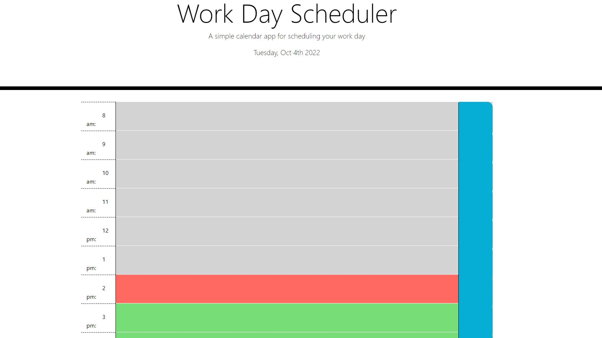

# Work Day Scheduler

## Deployed Link 
[Webpage](https://mkelly3.github.io/workDayScheduler/)

## Webpage Image


## Technologies Used
- HTML 
- CSS
- JavaScript
- JQuery
- Bootstrap 
- Git
- GitHub

## Description 
This application allows the user to input text for each hour of the day and save it to local storage. Therefore, when the webpage is reloaded the data is saved and will appear in the correct text box. Additionally, the background colors will change based on the time of day to represent past, present and future.

## Coding Snippet 
The function below uses Jquery elements and the this element to determine what the background color should be for each hour. By comparing the id given to each hour row and the current time the background color changes based on if the time has already past, it is the present time or if it is in the future. 

```
function determinePastPresentFuture(){
    //variable to determine the current time
    var timeNow = moment().hour();
    //console.log(timeNow);

    $(".time").each(function(){
        //console.log(this);
        //console.log(($(this).attr('id')));

        //making the IDs an integer 
        var scheduleTime = parseInt($(this).attr('id'));
        console.log(scheduleTime);

        if(scheduleTime === timeNow){
            $(this).removeClass("past");
            $(this).removeClass("future");
            $(this).addClass("present");
        }
        else if(scheduleTime < timeNow){
            $(this).removeClass("future");
            $(this).removeClass("present");
            $(this).addClass("past");

        }
        else{
            $(this).removeClass("past");
            $(this).removeClass("present");
            $(this).addClass("future");
        }

    });
}
```

## Author Links 
- [GitHub](https://github.com/mkelly3/)
- [Linkedin](https://www.linkedin.com/in/morgan-kelly15/)